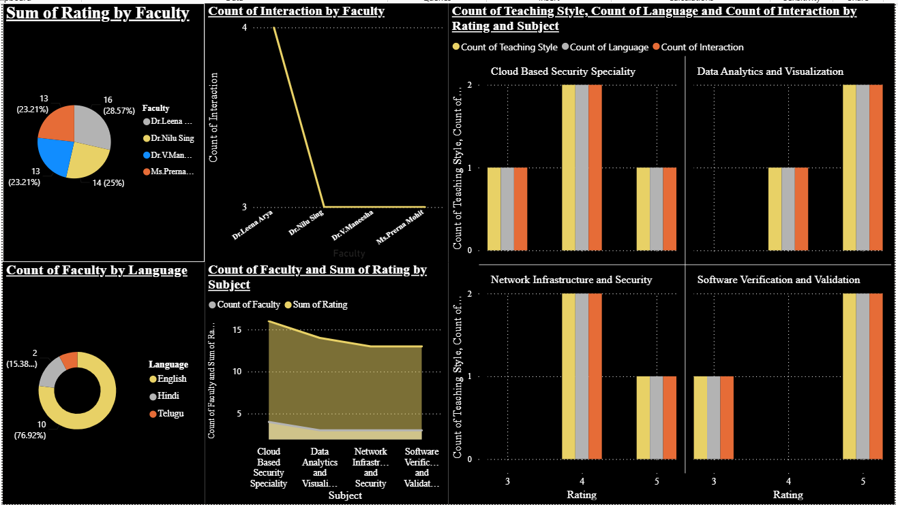

#  Cloud-Based Student Feedback Analytics System

<div align="center">


<br/>

**A cloud-powered system that collects student feedback through a web form, stores responses in real time on Google Cloud Firestore, and delivers actionable faculty performance insights through an interactive Power BI dashboard.**

<br/>

[  View Power BI Dashboard](https://app.powerbi.com/groups/me/reports/598ee4f0-e46b-4f76-a455-4ac3c76ac1db?ctid=808cc83e-a546-47e7-a03f-73a1ebba24f3&pbi_source=linkShare) &nbsp;·&nbsp; 

</div>

---

##  About The Project

In most universities, collecting and acting on student feedback is a slow, manual process. Forms get printed, collected, and often never properly analyzed. This project changes that.

Students fill out a simple web form — sharing how they feel about their faculty's teaching style, interaction quality, language of instruction, and overall performance. The moment they hit submit, their response is saved instantly to **Google Cloud Firestore**. From there, the data is automatically pulled into **Google Sheets** and visualized in a live **Power BI dashboard** — giving faculty coordinators a clear, real-time view of how each professor is performing across different subjects.

The goal is simple: **make student voices count, and make faculty improvement measurable.**

>  Built as part of a Cloud Computing project at **KL University (2026)**, this system demonstrates a complete end-to-end data pipeline — from a student clicking "Submit" to a coordinator reading insights on a dashboard.

---

##  Live Dashboard

Explore the fully interactive Power BI report here:

###  [Open Power BI Dashboard →](https://app.powerbi.com/groups/me/reports/598ee4f0-e46b-4f76-a455-4ac3c76ac1db?ctid=808cc83e-a546-47e7-a03f-73a1ebba24f3&pbi_source=linkShare)



### What the Dashboard Shows

| Visual | Insight |
|---|---|
|  **Sum of Rating by Faculty** | Dr. Nilu Sing leads with 28.57% of total ratings |
|  **Count of Interaction by Faculty** | Dr. Leena Arya has the highest student interaction (4) |
|  **Faculty & Rating by Subject** | Covers Cloud Security, Data Analytics, Network Infrastructure & Software Validation |
|  **Language Preference** | 76.92% of students prefer **Telugu**; rest prefer English or Hindi |
|  **Teaching Style Breakdown** | Per-subject analysis at ratings 3, 4, and 5 across all faculty |

---

## ☁️ Backend — Google Cloud Firestore

Every student submission is stored as a document inside the `feedbacks` collection in real time.


Each document captures:

| Field | Example |
|---|---|
| `name` | Hussain |
| `rollNumber` | 2300039032 |
| `faculty` | Dr. Nilu Sing |
| `subject` | Data Analytics and Visualization |
| `overallRating` | 4 |
| `interaction` | Frequently |
| `teachingStyle` | Better |
| `language` | English |
| `timestamp` | 28 March 2026 at 16:15 UTC+5:30 |
| `secureRollHash` | *(hashed for student privacy)* |

>  Roll numbers are hashed before storage — student identity is never exposed in the database.

---

##  How It All Connects

```
┌──────────────┐     ┌─────────────────────┐     ┌────────────────┐     ┌─────────────┐
│              │     │                     │     │                │     │             │
│  HTML Form   │────▶│  Cloud Firestore    │───▶│ Google Sheets  │───▶│  Power BI   │
│  (Frontend)  │     │  (NoSQL Real-time)  │     │ (Fetch Script) │     │  Dashboard  │
│              │     │                     │     │                │     │             │
└──────────────┘     └─────────────────────┘     └────────────────┘     └─────────────┘
 Student submits       Stored instantly             Auto-exported          Visual insights
 feedback online       in the cloud                 to spreadsheet         for coordinators
```

---

##  Key Features

| Feature | Description |
|---|---|
|  **Simple Web Form** | Students rate faculty, subject, teaching style, interaction & language preference |
|  **Real-Time Cloud Storage** | Every response is instantly saved to Google Cloud Firestore — no delays |
|  **Automated Data Pipeline** | Firestore data is fetched and exported to Google Sheets automatically |
|  **Interactive Dashboard** | Power BI report with filters, charts, and per-faculty/subject breakdowns |
|  **Student Privacy** | Roll numbers are securely hashed before being stored |
|  **Works Everywhere** | The feedback form is fully responsive — mobile, tablet, and desktop |

---

## 🛠️ Tech Stack

**Frontend**
- HTML5, CSS3, Vanilla JavaScript
- Firebase SDK (Firestore write integration)

**Cloud Backend**
- Google Cloud Firestore (NoSQL, real-time database)

**Data Pipeline**
- JavaScript Fetch API
- Google Sheets (as intermediate data store)
- `.xlsx` export for Power BI ingestion

**Analytics**
- Microsoft Power BI Desktop & Power BI Service

---


### Prerequisites
- A modern web browser
- Google Cloud account with Firestore enabled
- Node.js v16+
- Power BI Desktop (free from Microsoft)

### Setup

**1. Clone the repo**
```bash
git clone https://github.com/Supradeep1009/Cloud-Based-Student-Feedback-Analytics-System.git
cd Cloud-Based-Student-Feedback-Analytics-System
```

**2. Add your Firebase config in `frontend/feedback.html`**
```javascript
const firebaseConfig = {
  apiKey: "YOUR_API_KEY",
  authDomain: "YOUR_PROJECT.firebaseapp.com",
  projectId: "YOUR_PROJECT_ID",
};
```

**3. Run the data sync**
```bash
node scripts/fetch-to-sheets.js
```

**4. Open Power BI**

Open `analytics/StudentFeedback.pbix`, load your `.xlsx` file, and refresh the visuals.

---

---


---

<div align="center">


<br/>

📊 [View Live Power BI Dashboard](https://app.powerbi.com/groups/me/reports/598ee4f0-e46b-4f76-a455-4ac3c76ac1db?ctid=808cc83e-a546-47e7-a03f-73a1ebba24f3&pbi_source=linkShare)

<br/>

⭐ **Found this useful? Give it a star!** ⭐

</div>
